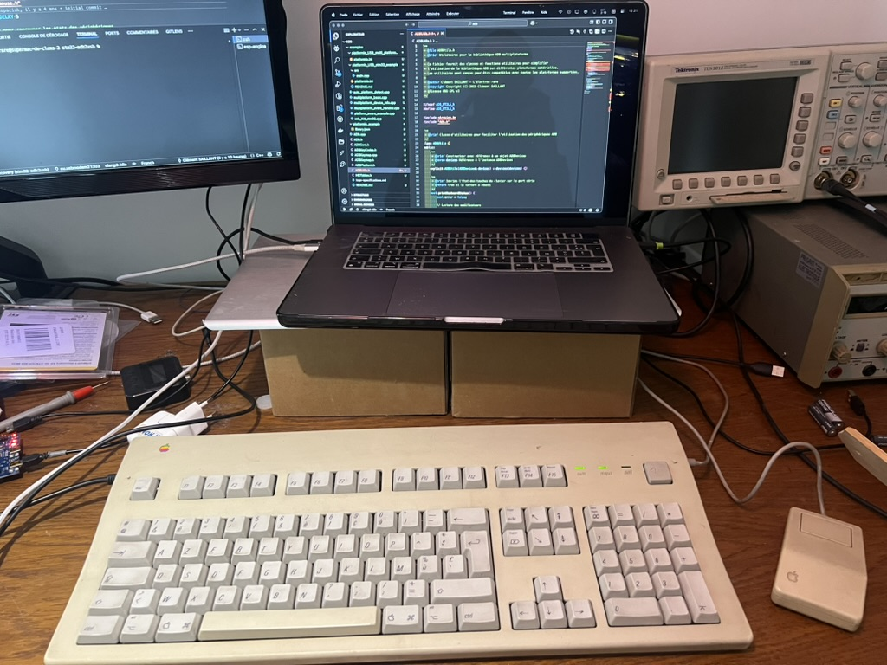

# 🍏 Apple ADB Ressurector


**Apple ADB Ressurector** : Donnez une seconde vie à vos trésors vintage ! 🕰️✨

Transformez vos claviers et souris Apple Desktop Bus (ADB) des années 80 et 90 en périphériques USB modernes avec ce projet passionnant ! 🎉
Compatible même avec les légendaires souris à un seul bouton, ce projet utilise PlatformIO pour donner une nouvelle vie à vos reliques de la pomme arc en ciel. 🖱️✨

---

## 🔗 Basé sur le travail de

Ce projet est basé sur le travail initial de [Szymon Łopaciuk](https://github.com/szymonlopaciuk/stm32-adb2usb). Vous pouvez consulter son dépôt ici : [stm32-adb2usb](https://github.com/szymonlopaciuk/stm32-adb2usb). Merci à lui pour son incroyable contribution à la communauté open source ! 🙌

---

## 🌐 Mon dépôt

Le code source de ce projet est disponible sur mon dépôt GitHub : [Apple ADB Ressurector](https://github.com/electron-rare/Apple-ADB-Ressurector). N'hésitez pas à y jeter un œil, à contribuer ou à poser des questions ! 😊

  
*Un aperçu de mon setup avec un clavier Apple d'époque et une souris ADB.*

---

## 🚀 Installation

1. Clonez ce magnifique dépôt :
   ```bash
   git clone https://github.com/electron-rare/Apple-ADB-Ressurector.git
   cd apple-adb-ressurector
   ```

2. Installez PlatformIO (si ce n'est pas déjà fait) :
   ```bash
   pip install platformio
   ```

3. Compilez et téléversez le firmware sur votre STM32 :
   ```bash
   platformio run --target upload
   ```

---

## 🎮 Utilisation

1. Branchez votre périphérique ADB à la carte STM32.  
2. Connectez la carte STM32 à votre ordinateur via USB.  
3. Admirez la magie : votre périphérique ADB fonctionne maintenant comme un périphérique USB ! ✨

---

## 🌟 Fonctionnalités actuelles

- **Clavier USB HID** : Conversion des touches ADB en rapports HID USB, avec gestion des modificateurs (Shift, Ctrl, etc.) et des touches spéciales (Caps Lock, Num Lock).  
- **Souris USB HID** : Conversion des mouvements et clics ADB en rapports HID USB.  
- **Gestion des LEDs** : Les LEDs Caps Lock et Num Lock fonctionnent comme par magie.  
- **Compatibilité HID** : Utilisation de `HID_Composite` pour gérer les rapports HID.  

---

## 📚 Bibliothèque ADB-pour-Framework-Arduino

Ce projet repose sur la bibliothèque [ADB-pour-Framework-Arduino](https://github.com/electron-rare/ADB-pour-Framework-Arduino), créée pour améliorer la portabilité et permettre une utilisation sur plusieurs plateformes (STM32, ESP32, Arduino AVR, Teensy).  

### Pourquoi cette bibliothèque ?  
Parce que je m'ennuyais, et que je voulais explorer les possibilités de GitHub Copilot pour compenser mes modestes compétences en programmation. Résultat : une bibliothèque qui fonctionne (presque) parfaitement et qui me fait passer pour un génie du code. Merci Copilot ! 🤖✨

- **Portabilité** : Compatible avec plusieurs plateformes.  
- **Modularité** : Réutilisable dans d'autres projets.  
- **Facilité de maintenance** : Centralisation des mises à jour.  

---

## 🤔 Pourquoi ce projet ?

Parce que je voulais retrouver le plaisir d'utiliser un ancien clavier Apple (et que j'avais ça qui traînait parmi tout mon bazar). Mais évidemment, il fallait bien le rendre compatible avec nos machines modernes. Alors, sur mon temps libre, j'ai fouillé sur le net pour voir ce que d'autres avaient déjà fait (parce qu'on est rarement le premier, soyons honnêtes !).  

Mais voilà, je ne trouvais pas exactement ce que je voulais, et comme j'avais des devkits qui prenaient la poussière, je me suis dit : "Pourquoi pas ?" Résultat : ce projet est né, réalisé et partagé pendant mes moments de libre. Parce que, après tout, c'est toujours plus sympa de redonner vie à ces vieux périphériques d'époque que de les laisser dormir dans un carton. 😄

---

## ⌨️ Claviers compatibles

- **Apple Keyboard (1987)** : Le clavier standard avec pavé numérique intégré. Simple, efficace, rétro.  
- **Apple Extended Keyboard (1987–1990)** : Le Saint Graal des claviers mécaniques Apple.  
- **Apple Extended Keyboard II (1990–1994)** : Une version améliorée, élégante et toujours aussi robuste.  
- **Apple Adjustable Keyboard (1993)** : Le clavier ergonomique avant-gardiste... mais un peu encombrant.  

---

## 🖱️ Souris compatibles

- **Original ADB Mouse (1986)** : La souris rectangulaire avec un seul bouton. Minimalisme à son apogée.  
- **ADB Mouse II (1993)** : Une version plus ergonomique, avec un bouton plus grand et une meilleure résolution.  

---

## 🛠️ Autres périphériques compatibles

- **Tablettes graphiques** : Wacom ADB, Kurta ADB.  
- **Trackballs** : Kensington Turbo Mouse, Microspeed MacTRAC.  
- **Joysticks** : Advanced Gravis MouseStick II.  
- **Lecteurs de codes-barres** : Datalogic Heron D130.  
- **Claviers alternatifs** : IntelliKeys.  

---

## 🛑 État du projet

Ce projet est actuellement en **beta**.  
Prochain objectif : transformer vos claviers d'époque en claviers Bluetooth grâce à un ESP32. Oui, on rêve grand. 🌈

---

## 🔮 Plans futurs

- Concevoir un PCB pour une alimentation par batterie et une connectivité Bluetooth.  
- Étendre le support à d'autres plateformes comme ESP32.  
- Améliorer la gestion de l'alimentation pour les périphériques ADB exotiques.  

---

## 📖 Ressources utiles

- [Guide to the Macintosh&copy; Family Hardware (2nd ed.)](https://archive.org/details/apple-guide-macintosh-family-hardware)  
- [ADB - The Untold Story](https://developer.apple.com/library/archive/technotes/hw/hw_01.html#//apple_ref/doc/uid/DTS10002470)  
- [Inside Macintosh volume V](https://archive.org/details/InsideMacintoshVolumeV)  

---

## 📝 TODO

- [x] Faire fonctionner le clavier.  
- [x] Faire fonctionner la souris.  
- [ ] Ajouter le support Bluetooth.  
- [ ] Gérer plusieurs périphériques ADB simultanément.  

---

## 💡 Remerciements

Un grand merci à **GitHub Copilot** pour son aide précieuse et ses suggestions parfois hilarantes. 🤖✨  
Et bien sûr, merci à **Szymon Łopaciuk** pour l'inspiration initiale.  

---

## 📜 Licence

Ce projet est sous licence GNU GPL v3. Voir le fichier [LICENSE](LICENSE) pour plus de détails.  

---
